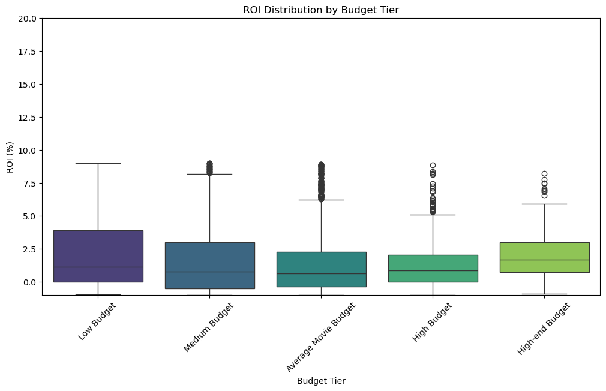
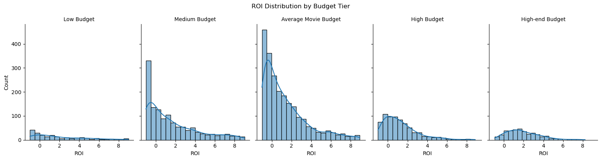
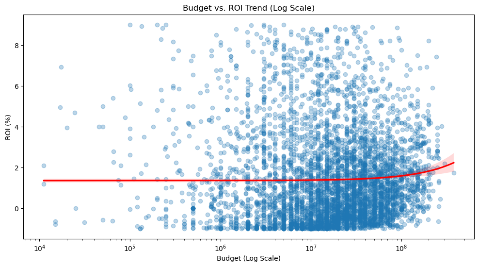
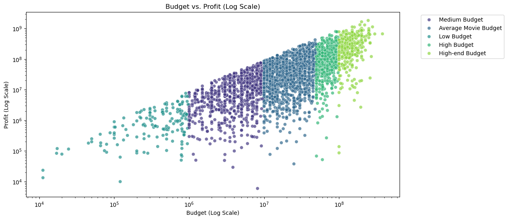
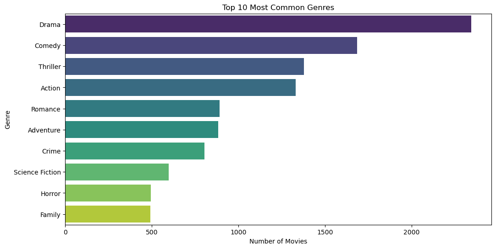
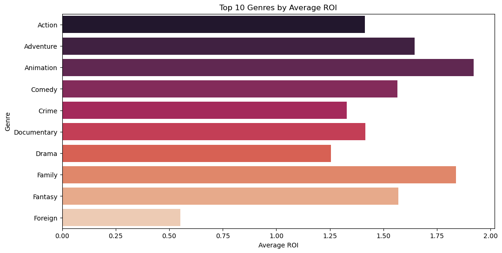
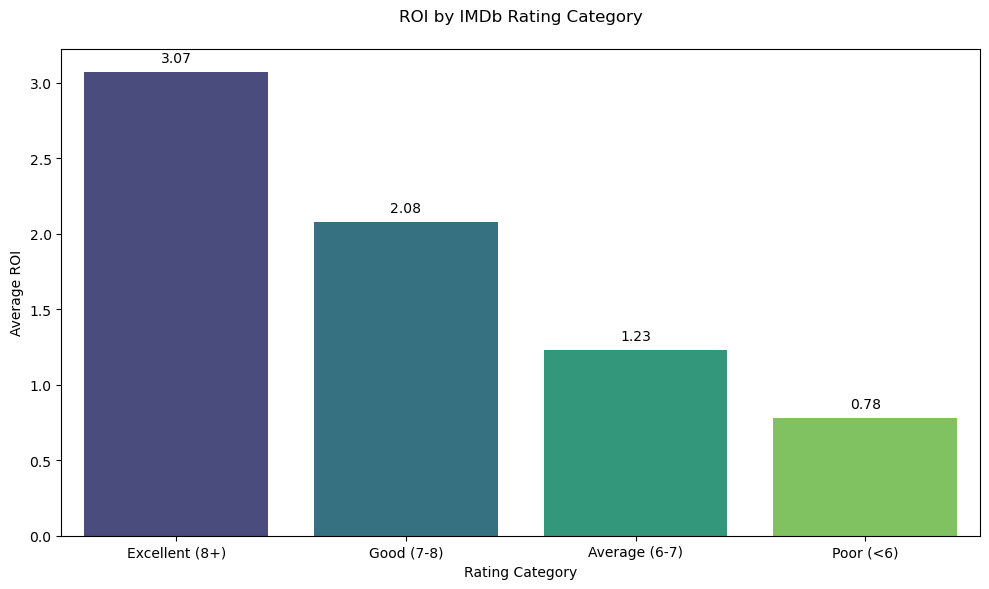
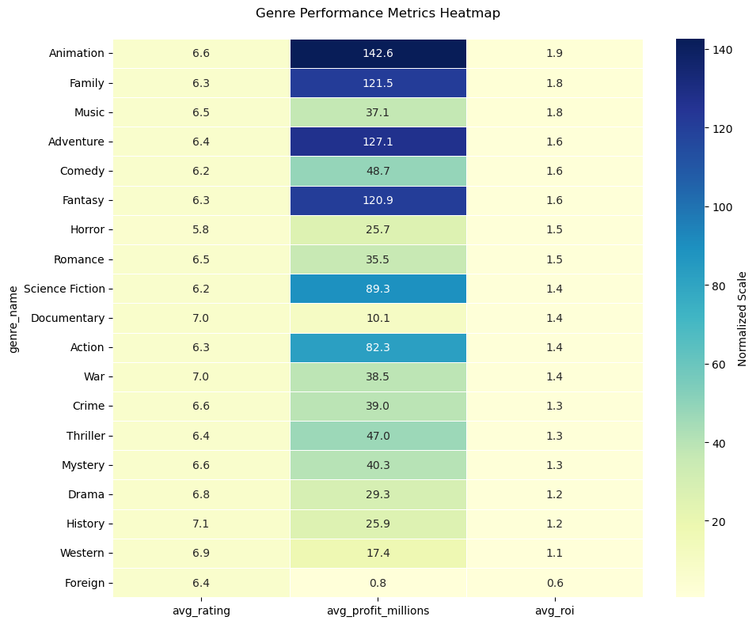
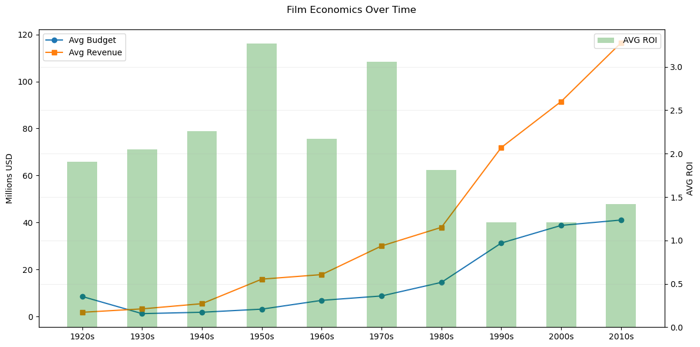
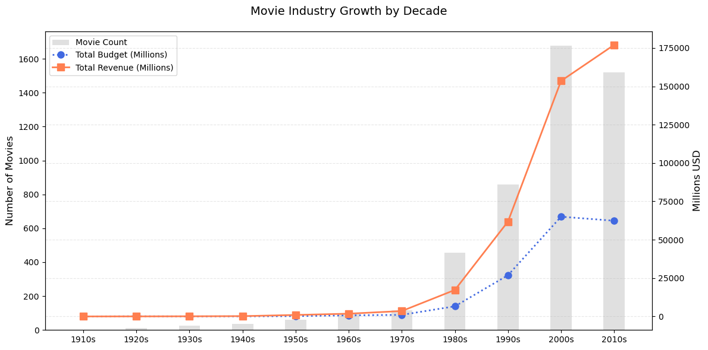

# Movie Budgets, Revenues, and Genres, Ratings and Trends Analysis

## 📌 Project Overview
This project analyzes the relationship between movie budgets, revenues, genres, audience rating and temporal trends to answer the following key questions:
1. **Do higher budgets guarantee higher profits?**  
2. **Which genres give the best return on investment (ROI)?** 
3. **Do highly-rated movies earn more, and does this vary by genre?**
4. **How have movie budgets and revenues changed over time?**

The analysis uses exploratory data analysis (EDA) and visualizations to uncover trends, risks, and opportunities in the film industry.

---

## 🔑 Key Questions
### Q1a: Do higher budgets guarantee higher profits?  
- Focus: Correlation between budget size, ROI, and absolute profit.  
### Q1b: Which genres give the best ROI?  
- Focus: Genre-based ROI performance and risk assessment.
### Q2:Do highly-rated movies earn more, and does this vary by genre?
- Focus: Genre-based and Rating-category-based ROI performance assessment.
### Q3: How have movie budgets and revenues changed over time?
- Focus: Average movie budgets, revenue & ROI by Decade assessment.
---

## 📂 Data Sources
- **Primary Dataset**: [The Movies Dataset](https://www.kaggle.com/datasets/rounakbanik/the-movies-dataset) or [IMDb Datasets](https://developer.imdb.com/non-commercial-datasets/).

- **Tools**: Python (pandas, matplotlib, seaborn), Jupyter Notebook, MySQL, MySQLWorkbench.

---

## 📊 Key Findings
### Q1a: Higher Budgets ≠ Higher ROI  
- **ROI decreases as budgets increase** (negative correlation).  
- **High-budget films** ($100M+) show occasional blockbuster outliers but generally low ROI.  
- **Mid-budget films** (e.g., $30–80M) have the highest risk of negative ROI.  

### Q1b: Best ROI Genres  
- **Animation** and **Family** genres consistently deliver high ROI.  
- **Action** and **Fantasy** genres have high revenue potential but require large budgets, lowering ROI. 

### Q2: Rating categories by ROI
- **Excellent (8+)** deliver 3.1x ROI
- **Good (7-8)** deliver 2.1x ROI
- **Average (6-7)** deliver 1.23x ROI
- **Poor (<6)** deliver 0.8x ROI

### Q3: Temporal Trends
- **1950s Peak** d3M→16M (4.1x ROI)
- **Modern Era(2000s-2010s)** 41M→116M (1.8x ROI)

- **1. Budgets ↑ 32%** (2000s: 38.7M→2010s:41M)
- **2. ROI ↓ 56% vs. 1950s** (4.1x → 1.8x)
- **3. Profit Margins Shrank:**
- **1950s:** 1 budget→5 revenue
- **2010s:** 1 budget→2.8  revenue
- **Critical Nuance:** Post-2000 ROI is stable (1.4x–1.8x) due to franchises/globalization.

-- **📈 Movie productio** peaked in the 2000s.
-- **💰Budgets** surged after the 1980s.
-- **🎬Blockbusters** drove massive revenue growth. (1990s and 2000s)
-- **📉2010s:** Fewer movies, higher revenues (streaming impact).
-- **⚖️Revenues** outpaced budgets—better monetization.

---

## 📈 Visualizations  
### Key Plots for Q1a:
1. **Number of Films by Budget Tier(Bar Plot)** Number of films in each budget tier(Average Movie Budget with highest number of films)
   
2. **ROI Distribution by Budget Tier(Box Plot)** 
   
3. **ROI Distribution by Budget Tier(Bar Plot)** 
  
4. **Budget vs. ROI Trend (Log Scale)**: Flat trend with slight upward curve for mega-budgets.  
     
5. **Budget vs Profit (Log Scale)** : High budget films tend to have higher profits.
  

### Key Plots for Q1b:  
1. **Number of Films by Genre (Bar Plot)** : Most common genre is Drama followed by Comedy and Triller.
  
2. **Average ROI by Genre (Bar Plot)** : Animation has the highest ROI followed by Family and Adventure.
  
 
### Key Plots for Q2: 
1. **ROI by IMDb Rating Category(Bar Plot)** : Excellent(8+) with highest ROI.
  
2. **Genre by Average Rating by Average Profit By Average ROI (Heatmap)** : Animation with a Average rating(6.6) dominates the lot by 1.9x ROI. Documentar and War with highest rating of 7.0 but lower ROI of 1.4x.
  

### Key Plots for Q3:
1. **Average Budget and Average Revenue and Average ROI by Decade (Time Series and Bar Plot)** : Check above for key findings.
  
2. **Number of movies and Total Budget and Total Revenue by Decade (Time Series and Bar Plot)** : Check above for key findings.
  

---

## 🛠️ Repository Structure  
movie_project/
│
├── 📄 README.md                 # Project documentation (see below)
│
├── 📂 data/
│   ├── 📂 raw/                  # Original datasets
│   │   ├── movies_metadata.csv  
│   │   └── title.ratings.tsv         
│   │
│   └── 📂 processed/            # Cleaned data
│       ├── films.csv
│       ├── film_company.csv
│       ├── film_country.csv
│       ├── films.info
│       ├── filtered_ratings.csv
│       ├── finance.csv
│       ├── genre.csv
│       ├── genre_film.csv
│       ├── production_company.csv
│       └── production_country.csv 
│
├── 📂 database/
│   ├── 🖼️ erd.png               # Entity Relationship Diagram
│   ├── 📄 schema.sql            # Table creation scripts
│   ├── 📄 queries.sql           # 10 analysis queries
│   ├── 📄 extra queries.sql     # 37 EDA queries
│   └── 📄 movie_db_export.sql   # Full database dump
│
├── 📂 notebooks/
│   ├── 📘 01_movies_metadata_cleaning.ipynb
│   ├── 📘 02_imdb_ratings_cleaning.ipynb
│   └── 📗 03_final_report.ipynb  # Main report
│
│
├── 📂 plots/
│   ├── 🖼️ plot1.png
│   ├── 🖼️ plot2.png
│   ├── 🖼️ plot3.png
│   ├── 🖼️ plot4.png
│   ├── 🖼️ plot5.png
│   ├── 🖼️ plot6.png
│   ├── 🖼️ plot7.png
│   ├── 🖼️ plot8.png
│   ├── 🖼️ plot9.png
│   ├── 🖼️ plot10.png
│   └── 🖼️ plot11.png
│
│
└── 📂 presentation/
    ├── 🎥 slides.pdf            # PDF backup
    └── 🔗 slides_url.txt        # [Online presentation link](https://docs.google.com/presentation/d/1wF8waaMsLTQoRmjI_cKrhaS_BKM_72nsxtVAFwjLKWU/edit?usp=sharing)